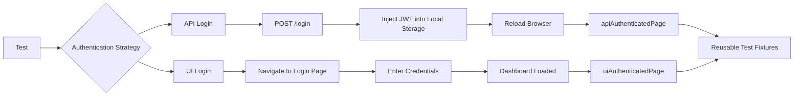
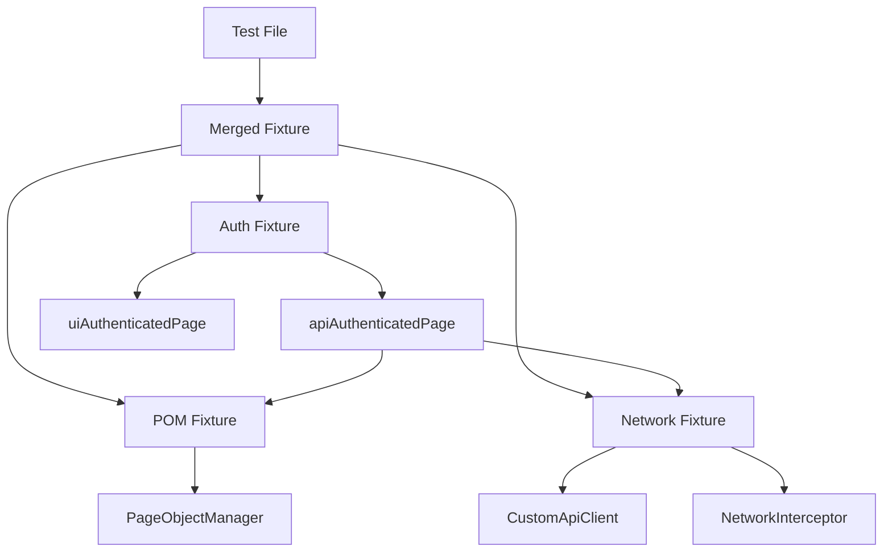
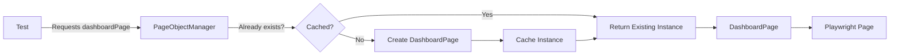

# EventHub UI Automation Framework

> A scalable end-to-end UI automation framework built with
> **TypeScript** and **Playwright**. While the sample application is
> intentionally small, the framework is designed around architectural
> patterns that continue to scale as the application grows.

------------------------------------------------------------------------

# Why this Framework?

Most Playwright repositories optimize for the present.

This project intentionally optimizes for growth.

Instead of coupling tests directly to Playwright APIs, responsibilities
are separated into dedicated layers:

-   Fixtures
-   Authentication
-   Page Objects
-   API Utilities
-   Network Utilities
-   Test Data Factories

The objective is to demonstrate maintainability rather than simply
automate a handful of test cases.

------------------------------------------------------------------------

# Technology Stack

-   Playwright
-   TypeScript
-   Faker
-   Dotenv
-   GitHub Actions (CI-ready)

------------------------------------------------------------------------

# Quick Start

``` bash
git clone <repository>
cd eventhub_ui_framework_playwrights
npm install
```

Create a `.env` file containing the required URLs and credentials.

Install browsers:

``` bash
npx playwright install
```

Run tests:

``` bash
npx playwright test
```

Open the HTML report:

``` bash
npx playwright show-report
```

------------------------------------------------------------------------

# High-Level Architecture

``` text
Tests
   │
   ▼
Merged Fixture Layer
   │
 ┌─┴───────────────┐
 │                 │
Authentication   Network
 │                 │
 └──────┬──────────┘
        ▼
 PageObjectManager
        │
   Page Objects
        │
   Playwright Page
```

------------------------------------------------------------------------

# Folder Responsibilities

``` text
src/
 ├── fixtures/
 ├── pages/
 ├── utils/
 ├── types/
test-data/
tests/
```

-   **fixtures/** -- dependency injection and browser lifecycle.
-   **pages/** -- page abstractions.
-   **utils/** -- reusable browser/API/network helpers.
-   **test-data/** -- factories and mock payloads.
-   **tests/** -- business scenarios.

------------------------------------------------------------------------

# Authentication Strategy

The framework supports two authentication models.



------------------------------------------------------------------------

# Fixture Strategy

Fixtures are intentionally composed instead of creating one monolithic
fixture.

-   Authentication fixture
-   Page Object fixture
-   Network fixture

These are merged into a single test interface.

Benefits:

-   Separation of concerns
-   Independent maintenance
-   Reusable dependencies
-   Cleaner tests





------------------------------------------------------------------------

# Page Object Strategy

Every page object is created through a central **PageObjectManager**.

Although the project currently contains only a few page objects, this
decision prepares the framework for applications containing dozens of
pages.

Benefits include:

-   Centralized object creation
-   Lazy initialization
-   Constructor changes affect one file
-   Tests never instantiate page objects directly



------------------------------------------------------------------------

# API Layer

A custom API client wraps Playwright's request context.

Advantages:

-   Shares authentication with the browser session
-   Supports GET, POST, PUT and DELETE
-   Simplifies hybrid UI/API testing

------------------------------------------------------------------------

# Network Layer

The framework exposes reusable network utilities for:

-   Mocking responses
-   Modifying live responses
-   Modifying outgoing requests
-   Aborting requests

This keeps network behavior reusable rather than embedding routing logic
inside individual tests.

------------------------------------------------------------------------

# Test Data Strategy

Instead of hardcoded values, test data is generated through factory
classes.

Advantages:

-   Reduced duplication
-   Realistic randomized data
-   Centralized maintenance

------------------------------------------------------------------------

# Scalability Decisions

Some abstractions may appear larger than the current application
requires.

This is intentional.

Examples include:

-   PageObjectManager
-   Merged Fixtures
-   Custom API Client
-   Network Interceptor

These decisions reduce maintenance costs as the framework grows from a
handful of pages to large enterprise applications.

------------------------------------------------------------------------

# CI/CD Strategy

Current framework capabilities:

-   Chromium and Firefox execution
-   HTML reporting
-   Screenshots on failure
-   Traces on retry
-   Environment-based execution

Recommended future improvements:

-   Browser matrix builds
-   Test sharding
-   JUnit reporting
-   GitHub annotations
-   Slack notifications
-   Artifact retention
-   Scheduled nightly regression
-   Smoke suite for pull requests

------------------------------------------------------------------------

# Future Extensions

Potential framework enhancements include:

-   Component Object Model
-   Workflow layer
-   Service layer
-   Builder pattern for test data
-   Accessibility testing
-   Visual regression testing
-   Docker support
-   Parallel environment execution
-   Cross-browser matrix
-   Advanced reporting dashboards

------------------------------------------------------------------------

# Design Principles

-   Keep business logic out of tests.
-   Keep page knowledge inside page objects.
-   Keep authentication reusable.
-   Keep fixtures composable.
-   Centralize object creation.
-   Prefer reusable utilities over duplicated code.
-   Optimize for maintainability over short-term convenience.

------------------------------------------------------------------------

# Sample Test

``` ts
test("Create Event", async ({ pomWithAPIAuthenticatedPage }) => {
    await pomWithAPIAuthenticatedPage.headerPage.goToAdmin();
    await pomWithAPIAuthenticatedPage.headerPage.createNewEvent();

    const event = EventFactory.createEventsWithOptionalFields();

    await pomWithAPIAuthenticatedPage.createEventPage.createEvent(event);
});
```

------------------------------------------------------------------------

# Closing Notes

This repository is intended as an automation framework showcase rather
than a collection of Playwright tests. The current application is
intentionally small, but the surrounding architecture demonstrates
patterns suitable for significantly larger UI automation suites.